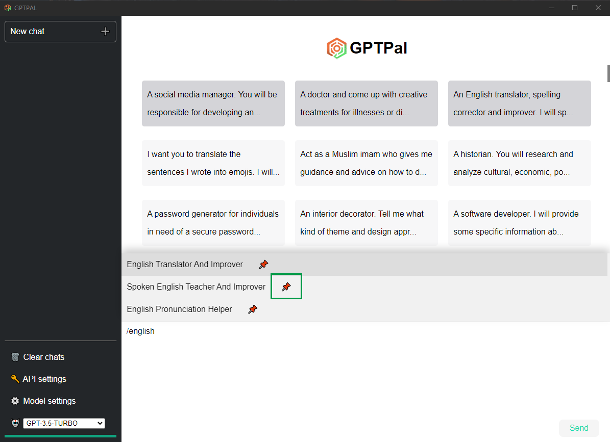

<h1 style="font-size: 5em; margin: 0;">GPTPal</h1>

Chat with GPTs just like chatting with your many friends.

[English](README.md) | [中文](README-zh.md)

A ChatGPT desktop application that allows you to chat with GPTs simultaneously. It records conversations locally and provides various features such as prompt suggestions, markdown rendering, highlighting and copying code, restoring window state, API, model, and proxy configuration, and pinning of prompts.

---

## Features

| Feature | Progress | Description |
| ------ | ------ | ------ |
| Chatting simultaneously with GPTs | ✔️ | The capability to chat with multiple GPTs simultaneously, with a notification when there is new message. |
| Conversations are recorded locally | ✔️ | All conversations are saved locally.|
| Sync prompts from the awesome repo | ✔️ | Ability to synchronize prompts from repo: awesome-chatgpt-prompts. |
| Prompts suggestions hints | ✔️ | Suggestions and hints for prompts to make chat more engaging. |
| Rendering markdown | ✔️ | Ability to render markdown in the chat window. |
| Highlighting &amp; Copying code | ✔️ | Ability to highlight and copy code from the chat window. |
| Restoring window state | ✔️ | Ability to restore the chat window to its previous state. |
| API configuration | ✔️ | Ability to configure the API for the GPT API. |
| Model configuration | ✔️ | Ability to configure the GPT model. |
| Proxy configuration | ✔️ | Ability to configure proxy settings for the API. |
| Pinning of prompts | ✔️ | Ability to pin frequently used prompts for quick access. |
| Language selection | 🚧 | Ability to select the language for the GPT models. |
| Token optimization | 🚧 | Optimization of token usage. |
| Token usage | 🚧 | Ability to check token usage with the API. |
| Cross platform | 🚧 | Ability to use the chat app on multiple platforms. |
| Theme | 🚧 | Ability to change the theme of the chat window. |
| Title modification | 🚧 | Ability to modify the title of the chat window. |
| Voice input | 🚧 | Ability to input text through voice recognition. |
| Prompts management | 🚧 | Ability to manage and organize prompts. |

## Installation

1. Download the latest release.

2. Install the downloaded file.

3. Launch the application.

## Usage

### Basic

1. Launch the application.

2. Click `API settings` button to open API configuration dialog.

    a. Set your API key, if you want to use `OPENAI_API_KEY` in the environment variable, leave it blank.
    b. Optionally, set your Organization.
    c. Optionally, set your proxy.
    d. Save.

3. Say "Hi" to GPT.

### Prompts

1. Click 'sync' button in the bottom right corner of the homepage to synchronize prompts from the [awesome-chatgpt-prompts](https://github.com/f/awesome-chatgpt-prompts/blob/main/README.md).

2. Input slash `/` to get prompts suggestions, press `Tab` to select the prompt.

3. You can pin your prompts by click 📌

    

### Config model

You can click `Model settings` button to change max_tokens, temperature, presence_penalty and frequency_penalty.

- max_tokens: integer, Optional, Defaults to inf

> The maximum number of tokens to generate in the chat completion.
> The total length of input tokens and generated tokens is limited by the model's context length.

- temperature: number, Optional, Defaults to 1

> What sampling temperature to use, between 0 and 2. Higher values like 0.8 will make the output more random, while lower values like 0.2 will make it more focused and deterministic.

- presence_penalty: number, Optional, Defaults to 0

> Number between -2.0 and 2.0. Positive values penalize new tokens based on whether they appear in the text so far, increasing the model's likelihood to talk about new topics.

- frequency_penalty: number, Optional, Defaults to 0

> Number between -2.0 and 2.0. Positive values penalize new tokens based on their existing frequency in the text so far, decreasing the model's likelihood to repeat the same line verbatim.
